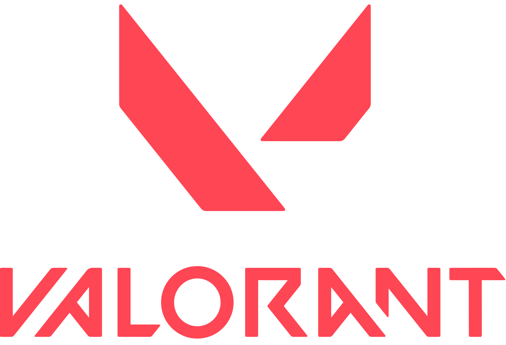
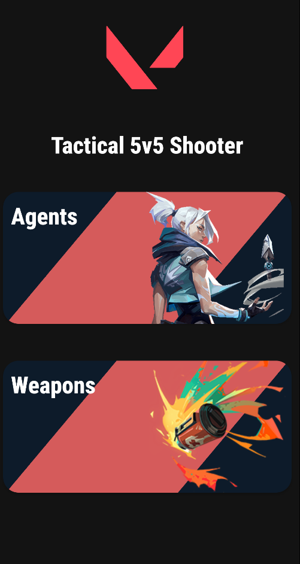
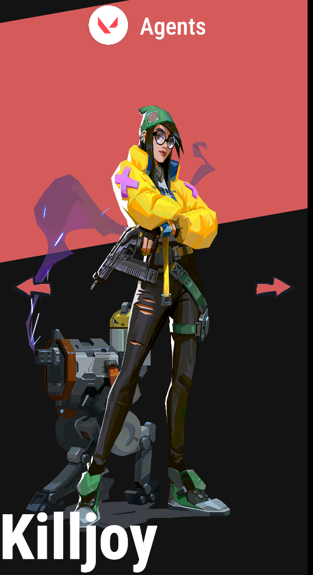

<!-- PROJECT LOGO -->

 

    
  <h3 align="center">Valorant App</h3>

  

    An awesome app to stay up to date on Valorant video game. :smile:
     
     
  

## About The Project

Informative application about the agents and weapons of the Valorant video game.

## Features:

* View information about all agents.
* View information about all weapons.

## Technologies Used:

This project uses Android development technologies (XML) to create an efficient and user-friendly application for exploring Valorant agents and weapons.

* Kotlin
* XML
* Dagger Hilt
* Coroutines
* Data retrieved from the Valorant API.
* Retrofit
* Clean Architecture & MVVM
* Basic animations when navigating.

## ScreenShots

  
